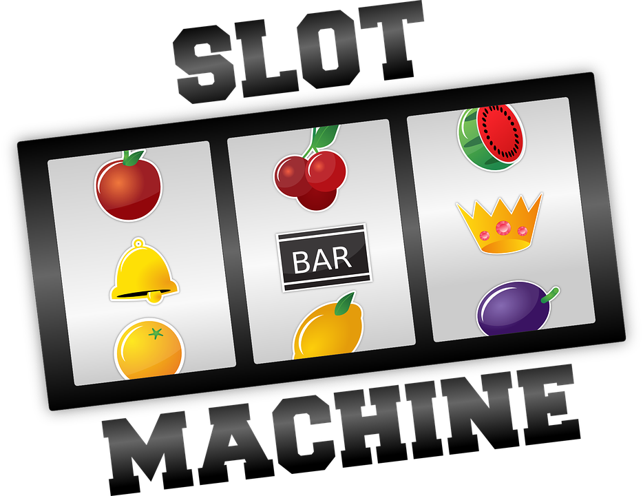

# Spring Cloud Lab - Slot Machine Service



A simple Spring Cloud "Slot Machine" :cherries: :cherries: :cherries: application, demonstrating Spring Boot development and common cloud / microservice patterns.  

The lab consists of a number of interconntected components including:
- A Slot Machine Service
- A Random Number Service
- A Service Registry (using Eureka)
- A Configuration Setting Server 
- A Circuit Breaker implementation (using Hystrix)
- A Hystrix Dashboard for monitoring applications

## Demo Requirements 

### Access to Maven Repositories 

If your computer has firewall restrictions, this may require updates to the following file: 

_${user.home}/.m2/settings.xml_

Consult your boss / lead if needed .. 

### Maven installed and available on commandline 

You can check by running _mvn_ from the commandline. 

In-lieu of installing the Maven tool, you can run the Maven Wrapper .. though note that it requires non-firewalled access to pull down it's dependencies,

```sh
$ ./mvnw spring-boot:run
```

### Your Java IDE of choice .. 

I recommend Intellij .. The Community addition is free. 

## Demo Troubleshooting 

### Timeout or connection issues during the build process 

This is most likley caused by firewall issues on your computer (espeically likley with corporate provided laptops).  Your company has likely provided you with work arounds, probably involing firewall configuration in the _${user.home}/.m2/settings.xml_  .. Consult your boss. 

### Port already in use 

Something else is already using the specified port in the _application.properties_ file.  You can either terminate it, or change the port to something else in the properties file. Via a browser, you can check what is currently using the port. 

### Project is not opening correctly in your IDE (including jav files are not accessible)

Ensure that your are __importing__ the project via Maven Pom.xml ,  instead of just opening files in your IDE.  Importing will ensure that the IDE correctly configured the project for Java Development.  Using Eclipse , you will need to open up the Maven subcategory when importing the project. 

## 0 - Initial setup
### Create the root project directory 
```sh
$ mkdir spring-cloud-lab
```
Subsequent projects / services will be places within this folder as they are generated using the Spring Initlizer quickstart generator.

A number of seperate Java projects will be created. 

To faciliate testing, it is a good idea to keep a seperate console and IDE window open for each Java project.

## 1 - Create the Random Number Service  
### 1.1 - Generate a Spring Boot Template from https://start.spring.io
Stick to the default settings, however update:
- artifact name to random-number-service
- for dependencies add Web, Actuator  

### 1.2 - Download the project folder into our spring-cloud-lab directory
### 1.3 - Open the project by importing the generated pom.xml with your IDE of choice
### 1.4 - Update the code base

Implement a /randomNumber endpoint that returns a random integer. 

This can be done by creating a *RandomNumberController* Java class file with:


```java
@RestController
public class RandomNumberController {

    @RequestMapping
    public int getRandomNumber(){
        return new Random().nextInt();
    }
}
```
### 1.5 - Run the application (from /spring-cloud-lab/random-number-service)
```sh
$ mvn spring-boot:run
```

### 1.6 - Test the /randomNumber endpoint at localhost:8080/randomNumber

You should see a randomly generated number response. 

## 2 - Create the Slot Machine Service
### 2.1 - Generate a Spring Boot Template from https://start.spring.io
Stick to the default settings, however update:
- artifact name to slot-machine-service
- for dependencies add Web, Actuator  

### 2.2 - Download the project folder into our spring-cloud-lab directory
### 2.3 - Open the project by importing the generated pom.xml with your IDE of choice
### 2.4 - Update the code base

Update the **application.properties** file to not have a conflicting port with our Random Number Service. 

```properties
server.port=8081
```

Implement a /spin endpoint that returns 3 random slot machine symbols. i.e. Cherry, Bar, Orange, Plum, etc

For example: 
- **Cherry Cherry Cherry**
- **Bar Orange Plum**
- **Orange Orange Cherry**

This can be done by creating a *SlotMachineController* class file with:


```java
@RestController
public class SlotMachineController {

    private RestTemplate restTemplate;
    private static final String[] slotMachineSymbols = {"Cherry", "Bar", "Orange", "Plum"};

    @Autowired
    public SlotMachineController(RestTemplate restTemplate){
        this.restTemplate = restTemplate;
    }

    @RequestMapping
    public String spin(){
        return "? ? ? "; //TODO implement me !
        //Example Rest Call:
        //restTemplate.getForObject("http://localhost:8080/randomNumber", Integer.class);
    }

}
```

Also add a RestTemplate Bean to our *SlotMachineServiceApplication* class:

```java
public class SlotMachineServiceApplication {

    public static void main(String[] args) {
        SpringApplication.run(SlotMachineServiceApplication.class, args);
    }
    
    @Bean
    RestTemplate restTemplate() {
        return new RestTemplate();
    }

}
```


__Implement your own solution to generate the random slot spin result at the TODO mark (in *SlotMachineController*) .. or scroll down for one such solution.__

```java

@RequestMapping
public String spin(){
    return String.format("%s %s %s", getSingleSpinResult(), getSingleSpinResult(), getSingleSpinResult());
}

private String getSingleSpinResult(){
    int randomNumber = restTemplate.getForObject("http://localhost:8080/randomNumber", Integer.class);
    return slotMachineSymbols[Math.abs(randomNumber % slotMachineSymbols.length)];
}
```


__BONUS__ - Add additional code to append winning status - for example "Cherry Cherry Cherry - You're a winner!!" 

### 2.5 - Run the application (from /spring-cloud-lab/slot-machine-service)
```sh
$ mvn spring-boot:run
```

### 2.6 - Test the spin endpoint at localhost:8081/spin

You should get a randomly generated slot machine response.

## 3 - Create the Service Registry  
### 3.1 - Generate a Spring Boot Template from https://start.spring.io
Stick to the default settings, however update:
- artifact name to service-registry
- for dependencies add EurekaServer, Actuator 

### 3.2 - Download the project folder into our spring-cloud-lab directory
### 3.3 - Open the project by importing the generated pom.xml with your IDE of choice
### 3.4 - Update the code base
We need to add the **@EnableEurekaServer** annoation to the ServiceRegistryApplication class file 

```java
@SpringBootApplication
@EnableEurekaServer
public class ServiceRegistryApplication {
```

Update the **application.properties** file to turn-off self-registry and configure Euruka to use the standard Euraka port of 8761 instead of the Spring Boot default of 8080

```properties
server.port=8761
eureka.client.registerWithEureka=false
eureka.client.fetchRegistry=false
```
### 3.5 - Run the application (from /spring-cloud-lab/service-registry)
```sh
$ mvn spring-boot:run
```

### 3.6 - Open the Service Registry Eureka Dashboard at localhost:8761

You should see the Eureka main page.

## 4 - Update the Random Number and Slot Machine Services to use the Service Registry  
### 4.1 - Update both service's pom.xml build scripts with required Eureka dependencies. 

Add the Eureka dependency:

```xml
<dependencies>
    <!-- exisitng dependencies are here -->
    
    <dependency>
        <groupId>org.springframework.cloud</groupId>
        <artifactId>spring-cloud-starter-eureka</artifactId>
    </dependency>
</dependencies>
```

Ensure the Spring-Cloud dependency block is present:

```xml
</dependencies>

    <dependencyManagement>
        <dependencies>
            <dependency>
                <groupId>org.springframework.cloud</groupId>
                <artifactId>spring-cloud-dependencies</artifactId>
                <version>${spring-cloud.version}</version>
                <type>pom</type>
                <scope>import</scope>
            </dependency>
        </dependencies>
    </dependencyManagement>
<build>
```

Addd the spring-cloud-version definition if needed:

```xml
<properties>
    <project.build.sourceEncoding>UTF-8</project.build.sourceEncoding>
    <project.reporting.outputEncoding>UTF-8</project.reporting.outputEncoding>
    <java.version>1.8</java.version>
    <spring-cloud.version>Edgware.SR2</spring-cloud.version>
</properties>
```

### 4.2 - Update the code base 
Add the **@EnableDiscoveryClient** annoation to both service's *Application* class files i.e. : 

```java
@SpringBootApplication
@EnableDiscoveryClient
public class SlotMachineServiceApplication {
```
Explicity set the **spring.application.name** property in the **application.properties** files for each service:

**Random Number Service** 

```properties
spring.application.name=random-number-service 
```

**Slot Machine Service**

```properties
spring.application.name=slot-machine-service 
```

Update the Slot Machine Service RestTemplate code to enable Service Discovery: 

Add the **@LoadBalanced** annoation to the RestTemplate Bean.
```java
@Bean
@LoadBalanced
RestTemplate restTemplate() {
    return new RestTemplate();
}
```

Update the RestTemplate call to use the service name (random-number-service) instead of address and port (localhost:8080). 

```java
restTemplate.getForObject("http://random-number-service/randomNumber"
```

### 4.3 - Restart both services (Slot Machine Service and Random Number Service)

For both service directories .. kill the existing processes (Ctrl-C) and restart:
```sh
$ mvn spring-boot:run
```

### 4.4 - Confirm registration of both Services in the Eureka portal at localhost:8761

You should see both the Random-Number-Service and Slot-Machine-Service listed under __Instances currently registered with Eureka__.

### 4.5 - Test the spin endpoint at localhost:8081/spin

You should see a randomly generated slot machine response.

## 5 - Enable a Circuit Breaker implementation for the Slot Machine Service

### 5.1 - Add the Hystrix dependency to the Slot Machine Service dependecy block in the pom.xml 

```xml
<dependencies>
    <!-- exisitng dependencies are here -->
    
    <dependency>
        <groupId>org.springframework.cloud</groupId>
        <artifactId>spring-cloud-starter-hystrix</artifactId>
    </dependency>
</dependencies>
```

### 5.2 - Update the code base

Add the **@EnableCircuitBreaker** annotation to the SlotMachineServiceApplication class

```java
@SpringBootApplication
@EnableDiscoveryClient
@EnableCircuitBreaker
public class SlotMachineServiceApplication {
```

Add the **@HystrixCommand(fallbackMethod = "defaultResult")** annotation the the spin method
```java
@HystrixCommand(fallbackMethod = "defaultSpinResult")
@RequestMapping
    public String spin(){
```

Implement a default result method in the Slot Machine Controller
```java
private String defaultSpinResult() {
    return "? ? ?";
}
```

### 5.3 - Restart the Slot Machine Serivce 

```sh
$ mvn spring-boot:run
```

### 5.4 - Confirm Circuit Breaker functionality 

Terminate the Random Number Service via the command line (Ctrl-C).

Attempt to call the localhost:8081/spin endpoint on the Slot Machine Service.

You should see the default fail back response of "? ? ?" in-lieu of a complete failure.

Restart the Random Number Service. 

Try the /spin endpoint again .. eventually it will re-enable communication with the now healthly Random Number Service -- the default wait time is 5 seconds.

## 6 - Create the Config Server
### 6.1 - Generate a Spring Boot Template from https://start.spring.io
Stick to the default settings, however update:
- artifact name to config-server
- for dependencies add Config Server, Actuator 

### 6.2 - Download the project folder into our spring-cloud-lab directory
### 6.3 - Open the project by importing the generated pom.xml with your IDE of choice
### 6.4 - Update the code base
We need to add the **@EnableConfigServer** annoation to the ConfigServerApplication class file 

```java
@SpringBootApplication
@EnableConfigServer
public class ConfigServerApplication {
```

Update the **application.properties** file to use the conventioal config port of 8888 instead of the Spring Boot default of 8888.
Enable the *native* profile to load configuration from local files / class path instead of the the GIT default.
Add an config server search location for /configs/application path.

```properties
server.port=8888
spring.profiles.active=native
spring.cloud.config.server.native.search-locations=classpath:/configs/{application}
```

Add some random test settings to a Slot Machine Service *application.properties* file.

In the */src/main/resources* folder of the Config Server .. create a *configs* and a *slot-machine-service* directory and add an *application.properties* file.
i.e. /src/main/resources/configs/slot-machine-service/application.properties

Add some settings:

```properties
test.setting=some_value
```

### 6.5 - Run the application (from /spring-cloud-lab/config-server)
```sh
$ mvn spring-boot:run
```

### 6.6 - Attempt to load default configuration settings for the Slot Machine Service via localhost:8888/slot-machine-service/default

You should see our created slot-machine-service test settings.

## 7 - Update the Slot Machine Services to use the Config Server

### 7.1 - Update the services's pom.xml build script with requireed Config dependency.

```xml
<dependencies>
    <!-- exisitng dependencies are here -->
    
    <dependency>
        <groupId>org.springframework.cloud</groupId>
        <artifactId>spring-cloud-starter-config</artifactId>
    </dependency>
</dependencies>
```

### 7.2 - Override a Slot Machine Service setting using the Config Server

In the *configs/slot-machine-service/application.properties* of the Config Server , add an existing Slot Machine Setting with a differnt value:

```properties
spring.application.name=different-slot-machine-service
```

### 7.3 - Restart the Slot Machine Serivce 

```sh
$ mvn spring-boot:run
```

### 7.4 - Confirm loading of the updated setting

At the beginiing of the Slot Machine Service console initlization, you should see that the congifuration was loaded:
__Fetching config from server at: http://localhost:8888__

In the case of the spring.application.name update, this should be reflected both the the Eureka service listings, and in the initial console initailzaition for Slot Machine Service.

## 8 - Create the Hystrix Dashboard Server
### 8.1 - Generate a Spring Boot Template from https://start.spring.io
Stick to the default settings, however update:
- artifact name to hystrix-dashboard
- for dependencies add Hystrix Dashboard, Actuator 

### 8.2 - Download the project folder into our spring-cloud-lab directory
### 8.3 - Open the project by importing the generated pom.xml with your IDE of choice
### 8.4 - Update the code base
We need to add the **@EnableHystrixDashboard** annoation to the HystrixDashboardApplication class file 

```java
@SpringBootApplication
@EnableHystrixDashboard
public class HystrixDashboardApplication {
```

Update the **application.properties** file to use a differnt port instead of the Spring Boot default of 8888.

```properties
server.port=8083
```

### 8.5 - Run the application (from /spring-cloud-lab/hystrix-dashboard)
```sh
$ mvn spring-boot:run
```

### 8.6 - Configure the Hystrix Dashboard at http://localhost:8083/hystrix 

Add the Slot Machine Service Hystrix stream for monitoring : http://localhost:8081/hystrix.stream 

### 8.7 - Make some Slot Machine Service /spin calls and monitor the usage in the Hystrix Dashboard

## 9 - BONUS - Externalize the Slot Machine symbol values (defined in the Slot Machine controller) 

First in the the Slot Machine Service configuration in application.properties. 

Then in the Config Server.

Allow for Slot Machine symbol value updates without Slot Machine Service restarts (hint : RefreshScope).

## 10 - BONUS - Update the Config Server to use the Registry Service , and for the Slot Machine Service to identify the Config Server via Eureka

## 11 - BONUS - Implement a distributed tracing solution using Spring Cloud Sleuth

## 12 - BONUS - Add Integration Tests with Mocking and actual invokation of endpoints using a random port. 

## 13 - BONUS - Add a Database compoment -- save each spin state, including the date. 

Demo DB Migrations .. and DB Testing (Spock can be a good candidate here) 

## 14 - BONUS - Secure the communication between the Random Number Service and the Slot Machine Service using Spring Security. 

## 15 - BONUS - Add Spring Boot Dev Tools to allow for automatic application restarts during development / code changes
